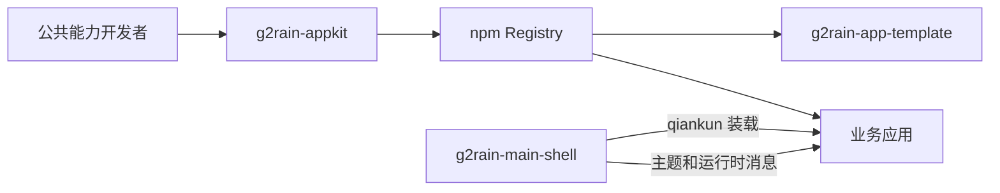
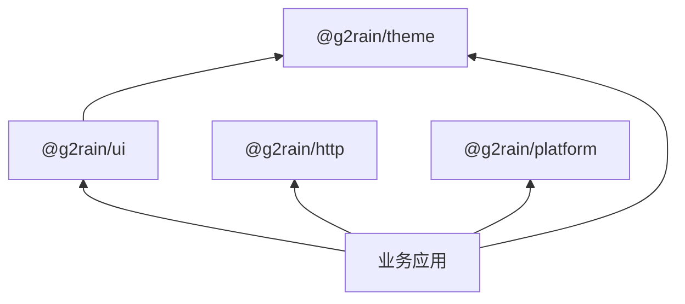

# 总体架构

## 1. 定位与目标

`g2rain-appkit` 是 G2rain 多个 Vue 应用共享能力的唯一事实来源。仓库使用 npm workspaces 管理可独立发布的包，同时保持各业务应用独立开发、构建和部署。

它解决跨仓库复制带来的缺陷修复不同步、实现分叉、主题不一致和公共能力无法独立演进等问题。

## 2. 系统上下文



## 3. 仓库分层

```text
g2rain-appkit/
├─ packages/
│  ├─ theme/       # 设计变量、主题和基础样式
│  ├─ ui/          # 通用 Vue 组件与组合式函数
│  ├─ http/        # HTTP Client、错误与拦截器
│  └─ platform/    # Main/Sub 协议、生命周期与可选能力
├─ examples/
│  └─ playground/  # 公共包组合验证
└─ docs/           # 架构、开发、发布和迁移文档
```

## 4. 依赖方向



约束：

- `theme` 位于依赖底层，不依赖 Vue、Pinia 或 qiankun。
- `theme` 是 CSS-only 包；DOM 主题切换和订阅属于 `platform/theme`。
- `ui` 以 peer 依赖声明 `@g2rain/theme`，但不能依赖业务应用。
- `http` 不读取应用环境变量，不持有具体 Token Store。
- `platform` 定义 Main/Sub 共享协议和装配能力，不包含业务页面、领域 API 或 Main Shell Store。
- `http` 与 `platform` 互不依赖；应用在组合根按需装配两者。
- `platform` 不强制依赖 `theme`；主题 CSS 由应用显式引入，主题 Controller 可选使用。
- 包之间不得形成循环依赖。

目标架构使用 `@g2rain/platform` 作为“前端应用运行与主子应用协作 SDK”的总称。包根只导出 Main/Sub 共享类型和协议，`/sub` 提供框架无关的实例生命周期与 Scope，`/main` 提供协调端口；目标身份模型为 `MicroAppDefinition → WorkspaceView → RuntimeInstance → RuntimeAdapter 私有 handle`。Main Shell 继续拥有 Workspace、RuntimeStore、实例队列和具体框架 handle，业务应用继续拥有 Vue、Pinia、Router、qiankun lifecycle 和独立启动逻辑。未发布的旧工作包已直接改名为 `@g2rain/platform`，不保留兼容入口。当前先在 Member 与 Main Shell 完成整体验证，再决定发布；库内实现不构成 npm 发布承诺。详见 [Platform 前端应用运行与主子协作方案](platform-framework.md)。

## 5. 运行模式

### 独立模式

业务应用自行加载配置、初始化主题、创建 HTTP Client 和装配运行时能力。

### qiankun 集成模式

主应用是页面级主题和微应用生命周期的所有者。子应用接收主应用下发的主题及公共事件，卸载时只释放自身资源，不修改主应用持有的全局状态。

## 6. 稳定性边界

以下内容属于兼容性承诺：

- 各包 `exports` 暴露的入口。
- 导出的 TypeScript 类型、组件 Props、事件和 Slots。
- CSS 语义变量名称。
- 微应用消息类型和载荷结构。
- HTTP 错误模型及工厂参数。

包内部目录、未导出模块、测试辅助代码和 Playground 实现不属于公开 API。

## 7. 非目标

- 不把所有业务应用合并成一个 Monorepo。
- 不将业务页面、领域 API、具体 Store 或路由放入公共包。
- 不要求所有应用同步升级公共包。
- 不以 `npm link` 作为正式制品验收手段。
