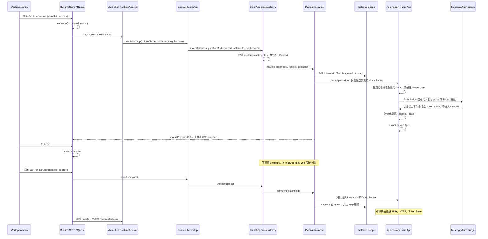

# G2rain Platform 前端应用运行与主子协作方案

- 状态：试点实施中
- 日期：2026-09-20
- 开发操作：[Main Shell 接入](../development/main-integration.md)、[业务 App 接入](../development/app-integration.md)
- 目标包：`@g2rain/platform`（Kernel、`/sub`、标准 Preset 和独立 Capability 已落地，Member 已接入 `/sub`，Main Shell 尚未接入 `/main`）
- 内部核心：Runtime Kernel
- 当前基线：`packages/platform` 已提供包根共享契约、`createSubPlatform`、`createStandardSubPlatform`、`resolveSubHostProps`、`createMainPlatform`，以及 Theme、Loading、Permission、Micro App、I18n、Error、HTTP Capability。这些能力可单独导入。`g2rain-member-app` 已接入 `/sub` 并于 2026-09-20 经用户确认为基本验证成功；Main Shell 的 `/main` 协调端口接线和联合验收仍未完成。

## 1. 背景

G2rain 业务 App 同时支持独立运行和微前端集成运行。当前各 App 分别编排 Vue、Store、主题、权限、HTTP、路由、主子应用消息和卸载清理，容易出现以下问题：

- 同一生命周期流程在多个仓库复制并逐渐分叉；
- qiankun API、浏览器全局变量和应用启动逻辑相互耦合；
- 监听器、Watcher、Client 和 Controller 的清理分散，重新挂载容易泄漏；
- 更换微前端框架或主题实现时影响应用主体；
- 公共原语虽然可以复用，但各 App 的装配方式仍不一致。

因此，统一入口不再命名为 Runtime，而命名为 Platform：

> `@g2rain/platform` 是 G2rain 前端应用运行与主子应用协作 SDK，负责共享协议、运行上下文、生命周期、国际化、错误处理、主题、权限、Loading、消息和资源释放；具体宿主、UI 框架、HTTP Client 和业务行为通过 Adapter、Capability 或 Provider 注入。

`Runtime` 继续作为 Platform 内部 Kernel 的技术概念，不再承担业务应用入口的产品命名。Platform 不是业务中台，也不替代 Vue、Main Shell、qiankun 或 HTTP Client。包根只公开 Main/Sub 共享协议，具体共性实现放在 `/main`、`/sub` 和能力入口；应用框架与宿主集成继续由 Main Shell 或业务应用负责。

### 1.1 命名边界

| 名称 | 定位 | 是否面向业务应用 |
| --- | --- | --- |
| `@g2rain/platform` | SDK 总称；导出 Main/Sub 共享类型、Context 和消息协议 | 是 |
| `@g2rain/platform/main` | Main Shell 侧协调能力和端口 | 是，面向主应用 |
| `@g2rain/platform/sub` | 子应用生命周期、PlatformInstance 和标准 Preset | 是，面向业务子应用 |
| Runtime Kernel | Context、状态机、生命周期、依赖顺序和释放 | 否，属于 Platform 内核 |
| 已删除的工作包名 | 从未发布；appkit 内目录与包名已改为 `@g2rain/platform` | 否；不保留兼容入口 |

由于旧工作包从未发布，也没有外部版本兼容承诺，appkit 已直接把目录、包名、exports 和内部引用改为 `@g2rain/platform`。最终制品只发布 `@g2rain/platform`，不建立别名包、转发入口或弃用周期。`g2rain-member-app` 已切换到 `@g2rain/platform` 本地制品。

### 1.2 现行实现基线

本方案以 `g2rain-main-shell` 的实例编排作为权威，以 `g2rain-manager-app` 和 `g2rain-department-app` 的子应用生命周期作为接入基线，并用 `g2rain-member-app` 验证 Appkit 试点差异。

Main Shell 当前已经具备：

- `AppDefinition`：当前按菜单项创建，`appKey` 实际等于 `menuItem.key`，`name` 才是实际 `applicationCode`；
- `RuntimeInstance`：以 `instanceId`（当前通常等于 `tab.key`）标识一个运行实例；
- `RuntimeStore.instances: Map<instanceId, RuntimeInstance>`：实例状态唯一事实来源；
- 每个 `instanceId` 独立的异步操作队列，串行 mount/unmount/remount/destroy；
- `QiankunAdapter.microApps: Map<instanceId, MicroApp>`：保存 qiankun 返回的实例句柄；
- 唯一 qiankun 运行名 `${app.name}__${instanceId}`、唯一容器和 `singular: false` 多活配置。

方案与现行代码的对应点：

| Main Shell 代码 | Platform 采用的事实 |
| --- | --- |
| `src/platform/types/app.type.ts` | 当前 `AppDefinition.appKey` 是菜单键，`name` 是实际应用标识；这是待迁移项 |
| `src/platform/types/runtime.type.ts` | `RuntimeInstance.instanceId` 是当前 Tab 运行实例键；状态不在 Platform 重建 |
| `src/platform/stores/runtime.store.ts` | `instances` 与 `microInstanceOpTails` 是跨实例状态和串行化权威 |
| `src/platform/apps/qiankun/app.qiankun.ts` | `microApps`、唯一 qiankun name、container、`singular: false` 和 mountPromise 属于 Main Shell RuntimeAdapter |
| `src/shell/layout/TabBar.vue` | Tab 激活、路由恢复、关闭和销毁仍由 Main Shell 驱动 |

Manager 与 Department 的 qiankun 入口都由 `vite-plugin-qiankun` 注册一次。Main Shell 对同一 `entry` 多次 `loadMicroApp` 时，这份 JavaScript 不会重新执行。两个应用因此用 `Map<appKey, { app, router }>` 分开 Vue 与 Router；Pinia、HTTP 和 Token Store 仍是模块级一份。`tokenExpired` 监听的引用计数留在应用 `runtime/boot`，不是 Platform 能力。

边界结论：

> Main Shell 是应用定义、WorkspaceView、RuntimeInstance、具体 RuntimeAdapter handle 和操作队列的唯一权威。Platform Main 只提供协调协议和适配端口。Platform Sub 在同一份 JavaScript 内按 `instanceId` 管理本次 `mount` 创建的 Vue、Router 和 Scope，不记录 Tab 是否打开，也不保存 qiankun handle。

### 1.3 目标身份模型

当前 `appKey/tab.key/tabKey/instanceId` 高度重合，消息中的 `appKey` 又实际承担实例定向职责。目标模型必须把“应用、打开的页面、运行实例和底层句柄”分开：

```ts
export interface MicroAppDefinition {
  /** 实际应用稳定标识，对应当前 applicationCode/name */
  applicationCode: string
  entryUrl: string
  contextPath: string
}

export interface WorkspaceView {
  /** 工作区中打开的页面视图标识 */
  viewId: string
  /** 来源菜单；未来允许同一菜单产生多个 viewId */
  menuKey: string
  type: 'main' | 'sub'
  title: string
  applicationCode?: string
  initialPath?: string
}

export interface RuntimeInstance {
  instanceId: string
  viewId: string
  applicationCode: string
  containerId: string
  status: 'created' | 'loading' | 'mounted' | 'inactive' | 'unmounted'
}
```

```text
MicroAppDefinition 1 ── N WorkspaceView
WorkspaceView       1 ── 0..1 RuntimeInstance
RuntimeInstance     1 ── 0..1 Adapter 私有 Handle
```

- `WorkspaceView` 表示用户在 Main Shell 工作区中打开的一个页面视图，不绑定 Tab UI、iframe 或 qiankun。
- 第一阶段允许 `viewId === menuKey`、`instanceId === viewId`，但类型和字段保持独立。
- MicroApp Store 以 `applicationCode` 为唯一键；同一应用从多个菜单出现时复用同一个定义。若这些菜单给出冲突的 `entryUrl/contextPath`，初始化必须显式失败，不能用 `getAppByName()` 静默取第一个。
- WorkspaceView 和 RuntimeInstance 通过 `applicationCode` 引用定义，不嵌入可变 `MicroAppDefinition` 对象；不能一边声明 App Store 是唯一来源，一边持有可能过期的定义快照。
- 底层 handle 不进入 Platform 公共协议。QiankunAdapter 当前保存 `MicroApp`，建议私有字段命名为 `qiankunHandlesByInstanceId`；Wujie、iframe 等 Adapter 分别保存自己的私有类型。
- 销毁顺序固定为“Adapter 释放 handle → RuntimeStore 删除 RuntimeInstance → WorkspaceStore 删除 WorkspaceView”。批量 clear 必须先 destroyAll，不能直接清空 RuntimeStore 后遗留 Adapter handle。

## 2. 目标与非目标

### 2.1 目标

- 统一 `create → bootstrap → mount → update → unmount → dispose` 生命周期。
- 让独立模式和微前端模式复用同一 Sub 生命周期内核，同时保留应用对启动流程的控制权。
- 统一管理监听器、Watcher、Controller 和其他释放函数。
- Theme、Loading、Permission、I18n、Error Handling、Micro App 等能力可插拔。
- 支持替换 qiankun，而不重写业务页面和公共能力。
- 支持替换品牌主题或 UI 框架，而不改变 Runtime Kernel。
- 统一语言状态、语言包装载、翻译接口和 UI 框架 Locale 同步。
- 统一错误标准化、错误码翻译、用户提示、标准动作和监控上报。
- 提供标准 Preset，避免每个 App 重复书写装配代码。
- 以 Main/Sub 两侧入口统一 props、消息、主题、Locale、Token 通知和生命周期协议。
- 保持按需导入和独立子路径，避免所有能力进入同一个 Bundle。

### 2.2 非目标

- Platform 不拥有业务页面、领域 API、业务 DTO 或 Mock 数据。
- Platform Main 不实现 Main Shell 的 WorkspaceView、布局、RuntimeStore 或 RuntimeAdapter 状态源。
- Platform 不接管应用 `main.ts`：环境读取、根容器选择、启动顺序、业务路由、业务 Store 和独立模式编排仍由应用负责。
- Platform 不内置具体 Token Store、IAM Endpoint 或 SSO 跳转规则。
- Platform 不生成 Vue Router 路由表，也不加载业务资源。
- Runtime Kernel 不直接依赖 qiankun、Element Plus、Axios 或 Pinia。
- Platform 不承诺更换 UI 框架完全零修改；它保证替换被限制在 Adapter、主题映射和 `@g2rain/ui` 内部。
- Platform 不取代 `@g2rain/http`；通过 Adapter 组合 HTTP，不让 Platform Kernel 依赖具体 Client。
- Error Handling 不吞掉所有异常，也不替代业务页面自己的校验和领域恢复流程。
- I18n 不持有业务文案事实来源，业务语言包仍由各应用维护和注册。

## 3. 总体结构

```mermaid
flowchart TB
  Def[MicroAppDefinition] --> View[WorkspaceView]
  View --> Store[RuntimeStore: RuntimeInstance]
  Store --> Main[@g2rain/platform/main]
  Main --> Queue[Per-instance operation queue]
  Queue --> Manager[Main Shell RuntimeAdapter]
  Manager --> Handle[Adapter-private handle]
  Handle --> Entry[应用自己的 qiankun 入口]
  Entry --> Sub["@g2rain/platform/sub\n一份 JS，一次 createSubPlatform"]
  Sub --> Locals["locals: instanceId to Scope"]
  Locals --> Vue[该实例的 Vue / Router]
  Sub --> Session[应用会话: Pinia / HTTP / Token]
  Sub --> Cap[Capabilities]
```

架构分为六层：

1. **Main Shell Stores**：分别管理 `MicroAppDefinition`、`WorkspaceView`、`RuntimeInstance`；运行状态和每实例操作队列只有一个事实来源。
2. **Platform Main**：提供公开上下文、消息信封、Theme/Locale/Auth 通知协调及 Main Shell 端口；不复制 RuntimeStore。
3. **Main Shell RuntimeAdapter**：把 `RuntimeInstance` 映射为 qiankun/wujie/iframe 实例句柄。
4. **应用宿主入口**：Main Shell 和子应用分别维护现有 qiankun 适配代码，只把公开协议映射到 Platform Main/Sub。
5. **Platform Sub**：一份子应用 JavaScript 只有一个 Definition。内部 `Map<instanceId, Scope>` 只保存该次 `mount` 创建的监听、Vue 和 Router。
6. **应用组合根 / Capability / Provider**：应用创建一次 Pinia、HTTP 和 Token Store，并在每次 `mount` 创建 Vue 与 Router；主题、I18n、Error、Loading、Permission 由 Capability 接入。

Main Shell 可以从同一个 `MicroAppDefinition` 创建多个 `WorkspaceView`，并为每个子应用 View 创建独立 `RuntimeInstance`。当前 `QiankunAdapter` 使用唯一运行名、独立容器、`singular: false` 和只开启 `experimentalStyleIsolation` 的 ProxySandbox。qiankun 2.10 的 ProxySandbox 隔离的是 `window` 属性，不是 Vite `type="module"` 的模块图。同一 `app.entry` 被加载多次时，子应用入口函数只有一份。

因此 Sub 的正常模型是：`createSubPlatform` 每个模块调用一次；多次 `mount(instanceId)` 可以并存。同一 `instanceId` 已挂载时再次 `mount` 才报错。Sub 的 Map 与 `RuntimeStore.instances` 可以使用同一个 `instanceId`，但存的不是一类事实：

| Map | 所有者 | 内容 | 不保存 |
| --- | --- | --- | --- |
| `RuntimeStore.instances` | Main Shell | 实例是否存在、`mounted` / `inactive`、容器、props、操作队列 | 子应用 Vue、Router、监听 |
| `QiankunAdapter.microApps` | Main Shell | qiankun `MicroApp` handle | 子应用模块状态 |
| `Map<instanceId, Scope>` | Platform Sub | 该次 `mount` 的 Scope、Vue、Router、实例监听 | Tab 是否打开、qiankun handle、`loadMicroApp` |

切走 Tab 时 Main Shell 只把 `RuntimeInstance.status` 改为 `inactive`，不调用 Sub `unmount`。只有关闭 Tab 并 `destroy` 时才 `unmount(instanceId)`。此时壳的 Map 可以是 `inactive`，Sub 的 Map 里 Vue 仍然挂着，这是同一事实的两面，不是两套状态机。

### 3.1 公开入口与依赖方向

```text
          @g2rain/platform
             ↑          ↑
platform/main      platform/sub
```

- Main 和 Sub 只能通过包根稳定类型与消息协议协作，不能互相导入实现。
- `@g2rain/platform/main` 不依赖 Vue、Pinia、Router 或子应用 Capability；Main Shell 自身可以继续直接依赖这些框架。
- `@g2rain/platform/sub` 不导入 Main Shell 的 Store、WorkspaceView、布局或 RuntimeAdapter。
- 包根不提供公开 `/core` 实现入口；它只导出 `RuntimeContext`、`PlatformMessage`、标识类型和其他稳定契约。
- Platform 不提供统一 `/vue` 或宿主专用入口。Vue、Pinia、Router 和 qiankun 适配继续留在应用。
- Main/Sub 暂时作为同一个 npm 包的严格 `exports` 子路径，确有独立发布需求后再评估物理拆包。

## 4. Platform Sub Definition 与实例内核

### 4.1 对外工厂与驱动权

子应用在模块加载时创建一次 Definition。Vue 和 qiankun 生命周期导出仍留在应用组合根；Pinia、HTTP 和 Token Store 也由组合根创建一次，不放进每次 `mount`：

```ts
import { createStandardSubPlatform } from '@g2rain/platform/sub'

const pinia = createPinia()

const definition = createStandardSubPlatform({
  applicationCode,
  createApplication(context) {
    const app = createApp(App)
    const router = createAppRouter(context)

    app.use(pinia)
    app.use(router)

    return {
      mount: container => app.mount(container),
      unmount: () => app.unmount(),
    }
  },
  i18n: { engine },
  error: {},
  capabilities: [theme, loading, permission, message, http],
})

// 以下 lifecycle 仍由应用导出给 qiankun。qiankun 会多次调用同一组函数。
export async function mount(props: AppQiankunProps) {
  const instanceId = resolveInstanceId(props)
  await definition.mount({
    instanceId,
    context: mapPropsToContext(props, instanceId),
    container: resolveContainer(props),
  })
}

export async function update(props: AppQiankunProps) {
  await definition.update(resolveInstanceId(props), mapPropsToContextUpdate(props))
}

export async function unmount(props: AppQiankunProps) {
  await definition.unmount(resolveInstanceId(props))
}
```

- Main Shell 通过 WorkspaceStore、RuntimeStore、AppManager 和 RuntimeAdapter 驱动实例；Platform 不创建 WorkspaceView 或调用 `loadMicroApp`。
- qiankun 模式由应用自己的入口接收 `bootstrap/mount/update/unmount`，完成 props、container 和认证映射后调用 Sub Definition。
- 独立模式由应用自己的 `main.ts` 读取环境、选择根容器、构造 Context，并直接调用 Sub Definition 的 `mount/unmount`；Platform 不提供 Standalone Bridge。
- 集成模式不得在应用 qiankun 入口之外再次手工 mount；独立模式也不得把预创建或已挂载的 Vue App 交给 Platform。
- 每次 `mount(instanceId)` 由 `createApplication` 创建新的 Vue App 和 Router，并登记到该 `instanceId` 的 Scope。不能把已创建或已挂载的 Vue App 传给 Platform。
- Pinia、HTTP、Token Store 和 `tokenExpired` 监听不属于这次 `mount`。监听的引用计数继续留在应用，不升成 Platform 租约。
- 路由表、资源加载、Token/SSO 初始化和业务 Store 装配继续留在 App 的 `createApplication` 或组合根；Preset 不成为第二个 `main.ts`。
- 切走 Tab 不是 `unmount`。只有主应用销毁该 `RuntimeInstance` 时，qiankun 才会调用上面的 `unmount(props)`。

### 4.2 公开上下文与挂载输入

包根导出显式、无敏感信息的 Context 契约；Kernel 不直接读取 `import.meta.env`、`window.__POWERED_BY_QIANKUN__` 或 qiankun Props：

```ts
export type RuntimeMode = 'standalone' | 'integrated'
export type G2rainTheme = 'light' | 'dark'

export interface RuntimeContext {
  /** 实际子应用稳定标识 */
  applicationCode: string
  /** Main Shell 工作区页面视图标识 */
  viewId: string
  /** Main Shell RuntimeInstance 的唯一实例键 */
  instanceId: string
  mode: RuntimeMode
  contextPath: string
  locale?: string
  theme?: G2rainTheme
  initialRoute?: string
  metadata?: Readonly<Record<string, unknown>>
}

export interface PlatformMountInput {
  context: Readonly<RuntimeContext>
  container: HTMLElement
  scope: RuntimeScope
}

export interface PlatformUpdateInput {
  context: Readonly<RuntimeContext>
  previous: Readonly<RuntimeContext>
  scope: RuntimeScope
}

export type RuntimeContextUpdate = Partial<
  Pick<RuntimeContext, 'locale' | 'theme' | 'initialRoute' | 'metadata'>
>
```

约束：

- `applicationCode`、`viewId`、`instanceId` 分别标识实际应用、打开的页面视图和运行实例，禁止复用同一个 `appKey` 字段表达三种含义。
- 当前子应用 props 仍把 `tab.key` 放在 `appKey` 中。迁移期应用入口使用 `instanceId = props.instanceId ?? props.appKey`、`viewId = props.viewId ?? props.appKey` 解析旧协议；Main Shell 补齐新字段后删除旧 `appKey` 定向语义。
- `container` 和 `scope` 是实例资源，不放入可序列化 Context。
- qiankun Props 只在 `mount` 才完整可用，因此不存在 `getInitialContext()`；应用入口在每次 mount 时校验并生成输入。
- `update` 只接受 `locale`、`initialRoute` 等可公开字段的新快照。集成模式首版没有主题字段；子应用继承主应用文档上的 `data-theme`。
- Token、Token Kid、私钥和完整用户资料禁止进入 Context、`metadata`、日志和错误上下文。
- 认证信息由应用 Auth Bridge 瞬时消费，应用 qiankun 入口不得把 Token props 映射进 Context，Kernel 也不保存副本。

Manager/Department 当前使用“首次 mount/update props + 后续 Token 消息”的混合模式，Platform 应允许在不污染 Context 的前提下迁移：

```ts
export interface AppAuthenticationBridge<THostAuth = unknown> {
  initialize(instanceId: string, input: THostAuth): void | Promise<void>
  update?(instanceId: string, input: THostAuth): void | Promise<void>
  disposeInstance?(instanceId: string): void | Promise<void>
}
```

`THostAuth` 只在应用宿主入口和 Auth Bridge 之间传递，Kernel、Capability 注册表、Context、错误上报和日志均不可读取或持久化它。未来改成纯 `REQUEST_TOKEN/TOKEN_RESPONSE/TOKEN_INVALID` 消息时，只替换应用 Auth Bridge。

### 4.3 Main Shell 状态与 Platform 本地状态

```text
Main Shell RuntimeInstance（权威）
  created → loading → mounted ⇄ inactive → unmounted → remove

Platform Definition（当前这份子应用 JS，只创建一次）
  created → bootstrapped → disposing → disposed
                   │
                   └─ locals: Map<instanceId, PlatformInstance>

PlatformInstance(instanceId)
  mounting → mounted ⇄ updating → unmounting → unmounted
```

- Main Shell 的 `RuntimeStore.instances` 和每 `instanceId` 操作队列继续负责跨 WorkspaceView 并发与状态，不迁入 Appkit。
- Main Shell RuntimeAdapter 私有保存 qiankun `MicroApp` handle。Platform 不维护 qiankun handle，也不保存第二份 `RuntimeInstance`。
- `bootstrap` 在当前这份 JavaScript 中最多一次，不创建 Vue App。
- 每次 `mount` 为对应 `instanceId` 创建 PlatformInstance、Scope、Vue App 和 Router。不同 `instanceId` 可以同时处于 `mounted`。
- 同一 `instanceId` 已处于 `mounted` 时再次 `mount` 明确报错。该 `instanceId` 完成 `unmount` 后允许重新 `mount`，并创建全新的 Scope 和 Vue App。
- `dispose` 先等待已经开始的 `bootstrap`、`mount`、`update` 和 `unmount`。进行中的 `mount` 在每次 `await` 之后若发现 Definition 已进入 `disposing`，就停止创建应用，并由自己的失败路径清理；不会在实例被移出 Map 后继续挂载。
- Main Shell 的 `inactive` 不是 Sub 状态。切走 Tab 时壳只改自己的 `RuntimeInstance.status`，Sub 里的 Vue 保持挂载。
- Platform 本地状态用于拒绝非法调用和保证清理，不回写或替代 Main Shell RuntimeInstance 状态。
- Main Shell 必须等待 `microApp.update()` 并将 update 纳入同一 `instanceId` 队列；当前 `updateInstanceProps` 未等待返回值，属于 Platform 接入前的 Shell 修复项。

### 4.4 所有权边界

| 所有者 | 负责内容 | 不负责 |
| --- | --- | --- |
| Main Shell | MicroAppDefinition、WorkspaceView、RuntimeInstance、唯一运行名、container、操作队列、Token/Locale 协调 | 子应用 Vue/Router/业务资源、根主题消息 |
| RuntimeAdapter | 当前框架的私有 handle，例如 qiankun `MicroApp`；按 instanceId 创建和释放 | 应用定义、WorkspaceView、业务状态 |
| Platform Sub | 当前 JavaScript 内 `Map<instanceId, Scope>`、该次 mount 的 Vue/Router/监听 | WorkspaceView、RuntimeInstance 状态、其他应用的 JS、`loadMicroApp` |
| App 组合根 | 一份 Pinia、HTTP、Token Store、SSO、业务语言包；`tokenExpired` 监听的引用计数 | Main Shell 实例编排、按 Tab 复制 Store |

Platform 不提供 Shared Resource Registry。Pinia、HTTP 和 Token Store 由应用组合根创建一次，供同一份 JavaScript 里的各个 `instanceId` 使用。`tokenExpired` 监听的引用计数留在应用 `runtime/boot`，不进入 Kernel。实例级资源只通过对应 Scope 释放；任一 `unmount(instanceId)` 不得调用跨实例 `disposeAll`。

Manager/Department 现有的 shell Map 属于这张 `Map<instanceId, Scope>` 要收编的资源索引，不是待观察的临时兼容，也不升级成 `RuntimeStore`。接入时把 `appKey` 解析为 `instanceId` 后写入 Sub，应用入口不再另持一份 Vue/Router 注册表。

### 4.5 Capability 与 Scope 契约

Capability、`PlatformMountInput` 和 Scope 属于 `/sub`，不是包根的 Main/Sub 通信协议：

```ts
export interface RuntimeCapability {
  readonly id: string
  readonly dependsOn?: readonly string[]
  bootstrap?(input: { scope: RuntimeScope }): void | Promise<void>
  mount?(input: PlatformMountInput): void | Promise<void>
  update?(input: PlatformUpdateInput): void | Promise<void>
  rollbackUpdate?(input: PlatformUpdateInput): void | Promise<void>
  unmount?(input: PlatformMountInput): void | Promise<void>
  dispose?(): void | Promise<void>
}

export interface RuntimeScope {
  add(dispose: () => void | Promise<void>): () => void
  child(): RuntimeScope
  dispose(): Promise<void>
  readonly disposed: boolean
}
```

Scope 是监听器、Watcher、DOM 句柄和实例资源释放函数的唯一机械释放登记处。执行规则：

1. Capability 按 `dependsOn` 顺序 mount，每个 Capability 使用独立 child Scope。
2. 当前 Capability mount 失败时，只 dispose 它的 child Scope，不调用其 `unmount`。
3. 已完成 Capability 按反向依赖顺序执行业务 `unmount`，随后 dispose 对应 child Scope；某一步失败不阻塞其余清理。
4. 正常 unmount 使用同一反向顺序；`unmount` 只做业务逆操作，不重复释放 Scope 内资源。
5. update 只有全部 Capability 成功后才提交新 Context。产生外部副作用的 update 必须实现 `rollbackUpdate`；失败时按反向顺序恢复，实例仍保留 previous Context。

### 4.6 qiankun 多实例时序



## 5. Platform Main 与 Sub 协作

### 5.1 Main 侧协调能力

`@g2rain/platform/main` 面向 `g2rain-main-shell`，统一双方协议，但不接管 Main Shell 状态：

- 从 Main Shell `RuntimeInstance` 生成公开的 `applicationCode/viewId/instanceId/locale/initialRoute` props；当前壳不传 theme；
- 将 Token 等敏感认证载荷与公开 Context 分离；
- 按 `instanceId` 或迁移期 `appKey` 构造和路由消息；
- 提供 Locale 和认证失效通知的发送接口；主题通知等主应用实际发出后再加入；
- 通过注入端口调用 Main Shell 已有的实例更新和消息能力。

```ts
export interface MainPlatformRuntimePort {
  updateInstanceProps(
    instanceId: string,
    props: Readonly<Record<string, unknown>>,
  ): Promise<void>
  emit<T>(message: RuntimeMessage<T>): void | Promise<void>
}

export interface MainPlatformCoordinator {
  buildPublicProps(context: Readonly<RuntimeContext>): Readonly<Record<string, unknown>>
  updatePublicContext(instanceId: string, patch: RuntimeContextUpdate): Promise<void>
  emitToInstance<T>(instanceId: string, type: string, data: T): Promise<void>
}
```

`MainPlatformRuntimePort` 由 Main Shell 现有 RuntimeStore、QiankunManager 和消息适配器实现。Platform Main 不包装 `loadMicroApp` 或 `MicroApp` handle，也不提供 qiankun 专用入口。

appkit 已落地 `createMainPlatform`。公开 props 类型是 `MainPublicProps`；`activeRule` 与 `entryOrigin` 通过 `MainHostFields` 附加，不写入 `RuntimeContext`。`notifyLocale` 与 `notifyAuthInvalid` 已提供，认证失效沿用 `g2rain:sub-app:token-invalid`。`releaseInstance` 只删除该实例的公开快照，不碰端口，也不保存 Token；快照已不存在时直接返回。定向消息是 `/main` 的 `MainDirectedMessage`，`appKey` 固定等于 `instanceId`。协调器不下发 `theme` 或 `metadata`，也不发送 `g2rain:main-app:theme-changed`。壳尚未实现 `runtimePort`。

### 5.2 Sub 侧应用集成边界

Main Shell 已有的 `RuntimeAdapter` 与子应用自己的 qiankun 入口是两层应用代码：

- Main Shell RuntimeAdapter 调用 `loadMicroApp`，持有 `MicroApp` handle，并在每个 `instanceId` 队列中驱动生命周期；
- 子应用入口把 qiankun props 映射为 Platform 输入，处理应用自己的容器、认证和资源初始化，再调用 Sub lifecycle。

Platform 根协议和 Sub 实现都不引用 qiankun。`RuntimeMessage` 从包根导出，`SubPlatformLifecycle` 和 `SubApplication` 从 `/sub` 导出。Main Shell 是集成模式实例生命周期的唯一外部驱动者：

```ts
export interface RuntimeMessage<T = unknown> {
  type: string
  data: T
  applicationCode?: string
  viewId?: string
  instanceId?: string
  requestId?: string
  timestamp: number
}

export interface SubMountRequest {
  instanceId: string
  context: Readonly<RuntimeContext>
  container: HTMLElement
}

export interface SubPlatformLifecycle {
  bootstrap(): Promise<void>
  /** `context.instanceId` 必须等于 `instanceId` */
  mount(input: SubMountRequest): Promise<void>
  update(instanceId: string, patch: Readonly<RuntimeContextUpdate>): Promise<void>
  unmount(instanceId: string): Promise<void>
}

export interface SubApplication {
  mount(container: HTMLElement): void | Promise<void>
  update?(context: Readonly<RuntimeContext>): void | Promise<void>
  unmount(): void | Promise<void>
}
```

应用的 qiankun 入口负责生命周期转发、容器校验和 Auth Bridge 调用；独立入口负责环境读取和启动顺序。Kernel 只接收标准 `SubMountRequest`。双壳差异由 `/sub` 的 `resolveSubHostProps` 在进内核前消掉：没有 `instanceId` 时把现行壳的 `appKey` 当作实例键，Token 只放进一次性 `auth`；有 `instanceId` 时要求完整的新壳身份，且 `appKey` 等于 `instanceId`。`createSubDirectedMessage` 的 `appKey` 同样固定等于 `instanceId`。这两处都不导入 qiankun，也不改 Kernel。Member 已按此边界接入，现行壳仍可通过 `appKey` 兼容路径驱动；Main Shell 尚未接入 `/main`。未来替换 qiankun 时修改 Main Shell RuntimeAdapter 和应用入口，不修改 Platform 公共协议或 Sub 内核。

## 6. Theme Adapter：隔离主题和 UI 框架

主题拆分为三个层次：

```text
主题状态和生命周期     → @g2rain/platform/theme
语义 Token 和品牌样式  → @g2rain/theme
具体 UI 框架变量映射   → Theme Adapter / @g2rain/theme 映射文件
```

目标接口：

```ts
export type G2rainTheme = 'light' | 'dark'

export interface ThemeAdapter {
  apply(theme: G2rainTheme): void | Promise<void>
  dispose(): void | Promise<void>
}
```

`G2rainTheme` 仍是 `@g2rain/theme` 的 `'light' | 'dark'`，对应 `data-g2-theme`。这不是 Main Shell 的现行主题协议。主应用写的是 `documentElement` 的 `data-theme`，取值包括 `light`、`dark` 和 `g2rain`，`setTheme` 不向子应用发消息，挂载 props 里也没有 theme。

主题所有权按模式区分：

- **独立模式**：应用可以调用 DOM Theme Adapter，把 `@g2rain/theme` 主题写入 `document.documentElement.dataset.g2Theme`；初始值选择和持久化策略仍由应用负责。
- **集成模式**：子应用继承主应用已经写在文档上的 CSS，不调用 `apply`，也不在 `unmount` 时删除根属性。首版不订阅尚不存在的 `g2rain:main-app:theme-changed`。主应用以后若要主动通知，再把当时的属性名和取值补进消息，不能提前收成两套主题。
- 多个 `instanceId` 可以分别持有订阅 Scope，但不能竞争修改全局 `:root`。

替换分为两类：

1. **品牌或配色替换**：替换 `@g2rain/theme` Token/主题文件，Runtime 不变。
2. **UI 框架替换**：替换 UI 变量映射、应用组合根和 `@g2rain/ui` 内部实现，Runtime Kernel、共享协议和 HTTP 契约保持稳定。

Runtime Kernel 不导入 Element Plus。Element Plus Loading、Message、MessageBox 或 Locale 适配由应用或独立 Adapter 注入。

## 7. 标准 Capability

### 7.1 Theme

- 保存和广播主题状态；
- 独立模式由应用决定何时调用 DOM Theme Adapter；
- 集成模式服从主应用已经应用在文档上的主题，不写根节点，也不注册主题消息监听；
- 独立模式允许应用提供初始值和持久化回调；
- 卸载不删除宿主拥有的全局主题状态。

### 7.2 Loading

- 提供引用计数和幂等结束函数；
- UI 的 `open/close` 由 Adapter 注入；
- 每次 `begin` 返回独立、幂等的结束句柄，并登记到当前 Instance Scope；
- Instance Scope 只结束本实例创建的句柄，不能把跨实例共享计数直接归零；
- 不直接拦截 Axios。

### 7.3 Permission

- 提供页面元素和 API 权限 Provider 契约；
- 可选提供 Vue 插件、指令和组合式函数；
- 权限数据加载、更新和业务授权决策由应用负责；
- Provider 缺失时默认拒绝访问。

### 7.4 I18n

I18n 是第一阶段标准能力，不只是保存 Locale：

- I18n Capability 是语言切换编排者，当前 Locale 的唯一事实来源是注入的 I18n Engine Adapter。
- 集成模式由 Main 下发、应用入口解析的 Context `locale` 驱动；独立模式由应用选择和持久化策略驱动。
- Engine Adapter 负责语言包加载、合并、翻译和缺失键回退。
- UI Locale Adapter 单独负责 Element Plus 等 UI 框架 Locale；Kernel 和 I18n Capability 不导入 UI 框架。
- Platform、公共组件和业务应用语言包由各自所有者注册，领域语言包不进入 Appkit。

目标契约示例：

```ts
export interface I18nEngineAdapter {
  getLocale(): string
  setLocale(locale: string): void | Promise<void>
  translate(key: string, params?: Readonly<Record<string, unknown>>): string
  loadMessages?(locale: string): void | Promise<void>
  subscribe?(handler: (locale: string) => void): () => void
  dispose?(): void | Promise<void>
}

export interface UiLocaleAdapter {
  applyLocale(locale: string): void | Promise<void>
  dispose?(): void | Promise<void>
}
```

应用可以用 Engine Adapter 连接 `vue-i18n`，Element Plus Adapter 只实现 `UiLocaleAdapter`。`@g2rain/ui` 不依赖 `@g2rain/platform`；公共组件继续通过 `G2rainUi` Provider 注入 `locale/translate`，应用组合根负责把 Engine Adapter 的函数接过去。

### 7.5 Error Handling

Error Handling 是第一阶段标准能力，并与具体 UI 提示解耦：

```text
业务错误 / HTTP 错误 / Kernel 错误 / 未捕获异常
                        ↓
                  错误标准化
                        ↓
       错误码映射 → 国际化文案 → 用户提示
                        ├→ 标准动作
                        └→ 日志与监控上报
```

它负责：

- 把未知异常、HTTP 错误和生命周期错误转换为统一 `PlatformError`；
- 无损保留 `G2rainHttpError` 的 `source/code/status/requestId/retryable`，并兼容现有应用的 `requestTime/errorCode`；
- 将后端错误码或平台错误码映射到 I18n key；
- 通过 Error Presenter 展示 Toast、Dialog、Inline 或 Error Page；
- 为登录失效、无权限、网络异常和服务不可用提供可替换的标准动作；
- 通过 Reporter Adapter 接入日志或监控系统；
- 支持应用覆盖映射、提示和恢复动作；
- 去重同一错误风暴，避免并发请求重复提示。

目标契约示例：

```ts
export type PlatformErrorSource =
  | 'network'
  | 'backend'
  | 'auth'
  | 'client'
  | 'business'
  | 'runtime'
  | 'unknown'

export interface PlatformError {
  /** 有效来源错误码；映射 G2rainHttpError 时保留原 code */
  code: string
  /** Platform 分类码，与后端 errorCode 分开 */
  platformCode?: string
  /** 后端原始 errorCode；非后端错误为空 */
  backendCode?: string
  source: PlatformErrorSource
  severity: 'info' | 'warning' | 'error' | 'fatal'
  message?: string
  messageKey?: string
  status?: number
  requestId?: string
  requestTime?: string
  cause?: unknown
  context?: Readonly<Record<string, unknown>>
  retryable?: boolean
}

export type StandardErrorAction =
  | 'reauthenticate'
  | 'forbidden'
  | 'retry'
  | 'show-error-page'

export interface ErrorPresenter {
  present(error: PlatformError, message: string): void | Promise<void>
}

export interface ErrorReporter {
  report(error: PlatformError): void | Promise<void>
}

export interface ErrorResolution {
  messageKey?: string
  action?: StandardErrorAction
  present?: boolean
  report?: boolean
}

export interface ErrorPolicy {
  resolve(error: PlatformError): ErrorResolution
}

export interface ErrorActionHandler {
  handle(action: StandardErrorAction, error: PlatformError): void | Promise<void>
}
```

标准 Preset 中 Error Capability 显式依赖 I18n；错误码先映射 `messageKey`，再调用 Engine Adapter 翻译。Error Capability 单独使用时允许不安装 I18n，固定降级顺序为 `error.message → backendCode/code → 通用未知错误文本`。

边界要求：Presenter 由 UI Adapter 注入，Kernel 不直接依赖 Element Plus；SSO 跳转、无权限页面和重试动作全部由 `ErrorActionHandler` 注入，Platform 不内置路由或 IAM 地址；Reporter/Presenter/Action Handler 失败不能覆盖原始错误；错误上下文不得包含 Token、私钥或完整用户资料。表单字段校验和领域补偿仍由业务处理。

### 7.6 Micro App Message

- 统一消息信封、类型守卫、发送、订阅和清理；
- 应用注入的 Event Adapter 负责具体传输；
- Token、路由和业务消息由应用注册处理器；
- 会话级处理器（例如写入共享 Token Store 的 `TOKEN_RESPONSE`）在 Definition 上注册一次，不按 `instanceId` 拆开；
- 实例级处理器（例如某个 Router 的 `afterEach`）登记到对应 Scope，`unmount(instanceId)` 只摘掉这一份；
- 一个实例 unmount 不修改其他 `instanceId` 的监听，也不拆除会话级处理器；
- Main Shell 若使用全局消息通道，按消息上的 `instanceId` 或迁移期的 `appKey` 定向；Platform 不建立第二份消息注册表；
- 未知消息被忽略，一个处理器失败不阻塞其他处理器。

### 7.7 HTTP Adapter

HTTP 是可选装配点，不成为 Runtime Kernel 对 `@g2rain/http` 的硬依赖：

```ts
export interface PlatformHttpBinding {
  updatePublicContext?(patch: Readonly<RuntimeContextUpdate>): void | Promise<void>
  /** 只释放 Binding 自己的订阅，不销毁共享 Client */
  dispose(): void | Promise<void>
}

export interface PlatformHttpAdapter {
  /** Definition bootstrap 时调用一次 */
  attach(): PlatformHttpBinding | Promise<PlatformHttpBinding>
}
```

应用在组合根创建 `@g2rain/http` Client，并在 Definition 生命周期内复用。一份 Definition 只有一个 Binding，locale 是所有实例共享的，后一次 `mount` 或 `update` 覆盖前一次。`mount` 会下发当时的 locale。`dispose` 释放的是 Binding 自己的订阅，不是 Client。单个 `instanceId` 卸载不得调用 `disposeAll`。HTTP 标准错误可以送入 Error Capability，但 Token Store、SSO、Auth Bridge、Mock 和 `tokenExpired` 监听继续属于应用。

## 8. 角色入口、官方 Preset 与体积控制

Main 和 Sub 使用不同工厂，避免一个模糊的根工厂同时承担主应用协调与子应用生命周期：

```ts
import { createMainPlatform } from '@g2rain/platform/main'
import { createStandardSubPlatform, createSubPlatform } from '@g2rain/platform/sub'

const mainPlatform = createMainPlatform({ runtimePort })

const subPlatform = createStandardSubPlatform({
  applicationCode,
  createApplication,
  i18n: { engine },
  error: {},
  capabilities: [theme, loading, permission, message, http],
})

const custom = createSubPlatform({
  applicationCode,
  createApplication,
  capabilities,
})
```

Sub 标准 Preset 强制启用 I18n 和 Error，且 Error 的 `dependsOn` 包含 I18n；其他能力按配置启用。高级调用方通过 `/sub` 的低层工厂自行组合 Capability。Main 和 Sub 工厂不使用同名函数，也不接受同一类配置；Sub Context 始终由应用入口在 mount 时提供。

Preset 只是组合器，不重新实现 Capability。为避免笨重：

- Kernel 和 Capability 使用独立 `exports` 子路径；
- qiankun、Vue、Pinia、Router 和具体 UI 框架不进入 Platform 运行入口；
- 未使用的 Adapter 不进入依赖图；
- Kernel 不设置框架级全局单例；
- 标准 Preset 不导入业务 Store、路由、环境配置和 Mock；
- 每个入口设置明确的 peer dependency，避免重复打包 Vue 或 UI 框架。
- 包根、Main、Sub、Theme、I18n 和 Error 契约不得在模块顶层导入 Vue。
- 某个能力确有跨应用复用的 Vue 绑定时，使用能力局部入口（例如 `/permission/vue`），不建立笼统的 `/vue`。

建议的目标入口：

```text
@g2rain/platform
@g2rain/platform/main
@g2rain/platform/sub
@g2rain/platform/theme
@g2rain/platform/loading
@g2rain/platform/permission
@g2rain/platform/permission/vue   # 仅在已有实现确有复用时
@g2rain/platform/i18n
@g2rain/platform/error
@g2rain/platform/micro-app
```

包根 `@g2rain/platform` 只暴露稳定的共享类型和协议，不导入 Main/Sub 的具体实现。入口仅表示目标模块边界；实现前必须核对真实复用、构建产物、peer dependency 和包体积，不一次性创建空入口。

## 9. Kernel 错误、日志与安全边界

- Kernel 生命周期错误标准化为 `PlatformError(source='runtime')`，保留阶段、Capability ID 和原始原因。
- 默认不吞掉 `bootstrap/mount/update` 错误；是否降级由应用或 Preset 决定。
- `unmount/dispose` 尽最大努力清理全部资源，最后返回聚合错误。
- 应用宿主入口传给 Auth Bridge 的敏感载荷不得进入 Context、任何 Platform 实例状态、错误对象或日志；使用完成后不得在 Platform 留存引用。
- Platform 不记录 Token、私钥、完整用户资料或消息敏感载荷。
- Host Context 不被视为后端可信身份，Gateway/服务端仍必须验证 Token 和权限。
- Adapter 不得把生产 Secret 放入浏览器配置或 Bundle。

## 10. 迁移计划

### 阶段 0：现有原语基线

- 以现有 Theme、Loading、Permission、Micro App 实现作为代码迁移基线。
- `g2rain-member-app` 已由应用组合根把独立模式和 qiankun 生命周期统一委托给 `@g2rain/platform/sub`，Vue、Pinia、Router、认证和资源加载仍由应用装配。
- appkit 已将目录改名为 `packages/platform`，包名与内部导入均为 `@g2rain/platform`。不发布旧包名，不提供兼容别名或转发入口；Member 试点已使用新制品名。

### 阶段 1：PlatformInstance Kernel 与 Scope

appkit 已实现 Definition、`Map<instanceId, PlatformInstance>`、Runtime Context、Capability 契约和 Instance Scope，并由 `@g2rain/platform/sub` 的 `createSubPlatform` 暴露低层工厂。Member 已通过应用自有 qiankun 入口接入该生命周期；Platform 本身仍不依赖 qiankun。

- 使用纯 TypeScript 测试不同 `instanceId` 并发挂载、同一 `instanceId` 重复 `mount` 拒绝、失败回滚、逆序释放和重新挂载。不在 Appkit 中实现 RuntimeStore 或 qiankun handle 表。
- Platform 包不接入 qiankun；由 Member 自有适配器转发宿主生命周期。`inactive` 不作为 Sub 状态测试；它只存在于 Main Shell。

### 阶段 2：Main/Sub 与现有应用契约

`@g2rain/platform/main` 的协调端口已在 appkit 定义。`/sub` 低层生命周期已在阶段 1 落地，并已提供现行壳与新壳的入口解析。Member 已改用 `/sub` 的入口解析与标准 Preset；Main Shell 的身份字段、props 拆分、update 队列、销毁顺序和 `/main` 端口接线尚未完成。

- Main Shell 继续维护 QiankunAdapter，子应用继续维护自己的 qiankun lifecycle；Platform 包不依赖 qiankun。
- 在 Main Shell 先明确目标身份：`MicroAppDefinition.applicationCode`、`WorkspaceView.viewId`、`RuntimeInstance.instanceId`；第一阶段允许三个对象的局部 ID 数值相等，但协议字段不再混用。
- 以 Main Shell 的 `RuntimeInstance`、唯一 qiankun name、唯一 container 和 per-instance queue 为宿主契约基线；qiankun `MicroApp` handle 保持 Adapter 私有。
- 以 Manager/Department 的容器校验、Vue/Router 创建顺序和 Token/Locale 行为建立子应用契约测试。
- Main Shell 显式传递 `applicationCode`、`viewId` 与 `instanceId`；迁移期应用入口支持从旧 `appKey` 回退解析实例和 View。
- 修复 Main Shell `updateInstanceProps`：`await microApp.update()`，并将 update 纳入同一个 `instanceId` 操作队列。
- 验证同一个 `MicroAppDefinition` 的两个 WorkspaceView 同时保持 Sub `mounted`；切走其中一个只在壳上变为 `inactive`，关闭后 `unmount` 不影响另一个的 Vue 和会话级 HTTP。

### 阶段 3：Platform 标准能力

appkit 已把 Theme、Loading、Permission、Micro App、I18n、Error 和可选 HTTP 做成可单独导入的 Capability。`createStandardSubPlatform` 强制先挂 I18n，再挂依赖它的 Error。`createSubPlatform` 仍只接受 `capabilities` 数组。Member 已使用标准 Preset，并由应用注入其余能力；Main Shell 尚未接入 `/main`。

- 把现有 Theme、Loading、Permission、Micro App 包装为 Capability。
- 新增 I18n Capability 和官方 `vue-i18n`/UI Locale Adapter。
- 新增 Error Capability、Presenter 和 Reporter Adapter 契约。
- 提供可选 HTTP 生命周期 Adapter，但不引入 `@g2rain/http` 硬依赖。

### 阶段 4：Main/Sub 联合试点与发布准备

- 在 `g2rain-main-shell` 接入 Main 协调端口，并把 `TabClass/TabTypes` 逐步迁移为 `WorkspaceView`；RuntimeStore 和 RuntimeAdapter 保持 Main Shell 所有，具体 handle 保持 Adapter 私有。
- [已完成] 在 `g2rain-member-app` 接入 Sub Preset；应用继续创建 Vue、Pinia、Router，并维护 qiankun lifecycle 和独立启动入口。
- 使用 Manager/Department 做兼容回归，确认现行 props、Token/Locale 消息和多实例行为不被破坏。
- 路由表、资源加载、SSO、Auth Bridge、Store 和业务语言包继续留在 App 组合根。
- 验证语言切换、错误码翻译、提示覆盖和错误上报降级。
- 同时验证独立模式、qiankun 模式和生产构建。
- 仅在上述 Member 与 Main Shell 联合验证全部通过后，发布包根共享协议、`@g2rain/platform/main`、`/sub` 和已证明复用的能力入口；不发布 `/core`、`/vue` 或 qiankun 子路径。

### 阶段 5：模板与 CLI

- `g2rain-app-template` 默认接入 Platform Sub Preset，同时生成由应用拥有的 Vue 和 qiankun 组合根。
- `g2rain-app-cli` 生成新的组合根，不再复制运行时编排代码。
- 其他 App 按版本独立迁移。

## 11. 验收标准

- Kernel 不依赖 Vue、qiankun、Element Plus、Axios 或 Pinia。
- `@g2rain/platform/main` 不依赖 Vue；Main Shell 自身继续正常依赖 Vue、Pinia 和 Router。
- 包根和 `@g2rain/platform/sub` 不依赖 Vue 或 qiankun；应用负责框架创建和宿主 lifecycle。
- Main Shell `RuntimeStore.instances` 是「有哪些运行实例、状态是什么」的唯一事实来源。Sub 可以保存 `Map<instanceId, Scope>`，但不得保存 `RuntimeInstance` 或 qiankun handle。
- 单元测试覆盖同一份 Definition 上多个 `instanceId` 并发、同一 `instanceId` 的重复 `mount`、错误回滚和逆序释放。
- 应用直接驱动的独立模式与应用 qiankun 入口使用同一 Sub lifecycle；Platform 不接管应用 `main.ts`。
- Main Shell 可用唯一 qiankun name 和 container 同时打开同一 `MicroAppDefinition` 的两个 WorkspaceView；切走 Tab 不调用子应用 `unmount`，关闭其中一个后另一个仍可路由、请求和接收消息。
- Vue App 与 Router 每次 `mount(instanceId)` 创建并只归该 Scope；Pinia、HTTP 和 Token Store 在组合根创建一次，单个 `unmount` 不销毁它们。
- Main Shell 对同一 `instanceId` 的 mount/update/unmount 串行执行，并等待 `microApp.update()` 完成。
- Platform 不读取 `window.__QIANKUN_PROPS__`，不导入 Main Shell Workspace Store，也不调用 `loadMicroApp`。
- 替换 RuntimeAdapter 或应用宿主入口不修改业务页面、Theme/Permission/Loading Capability。
- 替换主题 Token 不修改 Runtime；替换 UI 框架不修改 Kernel 和共享协议。
- 替换 `vue-i18n` 或 UI 框架 Locale 实现不修改业务页面的 Platform 契约。
- Error Presenter、Reporter 和错误映射可单独替换，Reporter 故障不影响原始业务异常。
- 主应用与微应用切换语言后状态一致，公共组件和 UI 框架文案同步更新。
- 未启用的 Adapter 不进入应用生产依赖图。
- 同一 `instanceId` 经历 mount → unmount → mount 后，该实例的监听器数量不增加；另一个仍挂着的 `instanceId` 不受影响。
- `tokenExpired` 监听的引用计数留在应用。Sub 不在单个 `unmount` 时停止这条监听，也不得调用跨实例 `disposeAll`。
- Definition `dispose` 后所有 Capability、Adapter 和 Scope 均停止产生副作用。
- `g2rain-member-app` 类型检查和生产构建通过，并完成双模式冒烟。
- npm pack 制品只暴露存在且经过验证的入口。

## 12. 变更和回滚

- 旧工作包从未发布，因此直接改名，不承担 npm 版本兼容成本。appkit 内改名已完成。
- appkit 的 workspace、源码导入、Playground、文档、构建检查和 pack 检查已切换到 `@g2rain/platform`，Member 试点也已切换到新制品名；仓库内不再保留旧包消费入口。
- 最终只允许 `@g2rain/platform` 出现在待发布制品清单中；Runtime 仅可作为内部类型和 Kernel 术语出现。
- Member 试点期间保留一次版本回退能力；回滚只需恢复组合根和包版本。
- Platform 生命周期或消息协议发生不兼容变化时使用新的主版本，并提供迁移说明。
- Member 的真实 App 试点基本通过后，仍需完成 Main Shell `/main` 接线、主子联合验收、发布候选制品核对和平台推广，才能标记为正式平台闭环。

## 13. 已冻结的首版决策

1. `Platform` 保留为总称，定义为“G2rain 前端应用运行与主子应用协作 SDK”；它不是业务中台，也不替代 Vue、Main Shell、qiankun 或 HTTP Client。
2. 包根导出 Main/Sub 共享协议，`/main` 和 `/sub` 提供角色实现；不提供公开 `/core`。
3. Main Shell 管理 MicroAppDefinition、WorkspaceView、RuntimeInstance 和每实例操作队列；具体 RuntimeAdapter 私有管理底层 handle。Platform Main 不复制这些注册表，也不提供任意全局服务定位器。
4. 不提供统一 `/vue`。Vue、Pinia、Router 和插件装配由应用拥有；只有已证明复用的能力绑定才允许使用能力局部入口，例如 `/permission/vue`。
5. 不提供 `/main/qiankun` 或 `/sub/qiankun`。Main Shell 保留 RuntimeAdapter，子应用保留自己的 qiankun lifecycle。
6. `applicationCode`、`viewId`、`instanceId` 分别表示实际应用、工作区页面视图和运行实例；旧 `appKey` 仅用于迁移兼容。Main Shell 负责同一 `instanceId` 操作串行。一份子应用 JavaScript 只调用一次 `createSubPlatform`，多个 `instanceId` 可以同时 `mounted`。
7. Sub 标准 Preset 强制启用 I18n 和 Error；Error 依赖 I18n。Error Capability 可单独使用，并按固定规则降级文案。
8. `@g2rain/theme` 的主题名首版保持 `'light' | 'dark'`。集成模式子应用不写根节点，并继承主应用现行的 `data-theme`（含 `g2rain`）；首版不引入 `theme-changed` 消息。
9. Main Shell 是集成模式生命周期唯一驱动者，Platform Sub 不接受预创建的 Vue App，也不存在第二条 `platform.mount(app)` 控制流。切 Tab 只改壳的 `inactive`，不调用 Sub `unmount`。
10. Token 不进入 Runtime Context。Manager/Department 当前 props 初始化由应用 Auth Bridge 写入会话级 Token Store，后续可替换为纯消息实现。
11. Pinia、HTTP 和 Token Store 由应用组合根创建一次。Vue、Router 和实例监听按 `instanceId` 隔离。Kernel 不提供 Shared Resource Registry，也不接管 `tokenExpired` 引用计数。
12. 不提供 `/sub/standalone`。应用自己的 `main.ts` 驱动独立模式，只复用 Sub lifecycle、Scope 和 Capability 等共性能力。

以上决定是 Main/Sub 实现开工前置条件。后续仍可根据真实复用和包体积实测调整物理拆包，但不得改变这些生命周期与安全语义。
