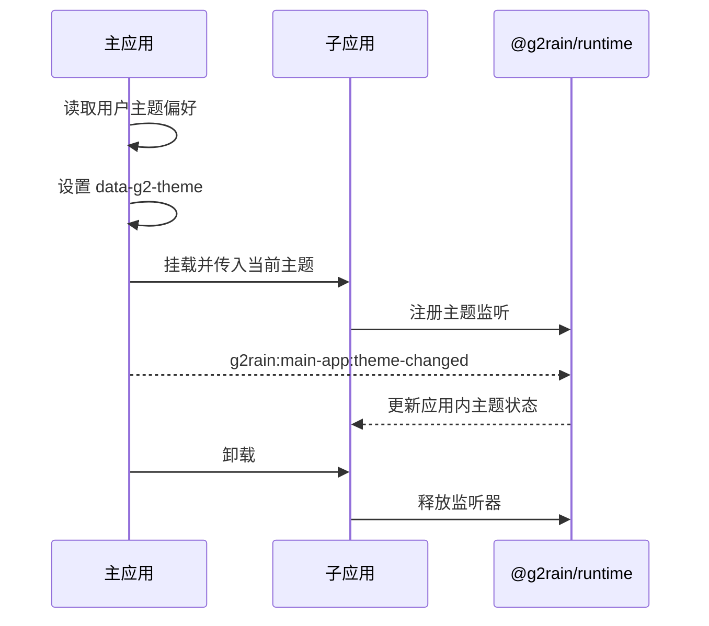

# 主题与微应用协作

## 1. 主题所有权

- 独立运行时，应用拥有主题状态并负责初始化。
- qiankun 集成运行时，`g2rain-main-shell` 是主题状态的唯一所有者。
- 子应用可以读取主题，但不得在集成模式下覆盖根节点的平台主题。

## 2. 主题契约

业务组件只使用 `--g2-*` 语义变量。Element Plus 变量由 `@g2rain/theme` 统一映射，不作为 G2rain 组件的直接设计契约。

```css
.panel {
  color: var(--g2-text-primary);
  background: var(--g2-bg-container);
  border: 1px solid var(--g2-border-color);
}
```

主题通过根节点属性切换：

```html
<html data-g2-theme="dark">
```

## 3. 生命周期



## 4. 消息协议

```ts
export type G2rainTheme = 'light' | 'dark'

export enum MicroAppEventType {
  THEME_CHANGED = 'g2rain:main-app:theme-changed',
}

export interface ThemeChangedData {
  theme: G2rainTheme
}

export type ThemeChangedMessage = MicroAppMessage<
  MicroAppEventType.THEME_CHANGED,
  ThemeChangedData
>
```

协议演进要求：

- 新增可选字段属于兼容变更。
- 删除字段、改变字段含义或收窄取值范围属于不兼容变更。
- 消息处理器应忽略无法识别的消息类型，避免不同版本应用相互阻塞。
- 挂载和卸载必须成对注册、释放监听器，支持重复加载。

消息使用既有 `MicroAppMessage` 信封的 `data` 字段，不引入并行的 `payload` 信封。主应用设置根节点属性后，CSS 已可自动继承；消息用于同步子应用内部状态和触发非 CSS 行为。

## 5. 样式加载顺序

应用显式决定全局样式加载顺序：

```ts
import '@g2rain/theme/styles.css'
import '@g2rain/ui/style.css'
```

`styles.css` 必须按 `tokens → light → dark → element-plus → base` 的顺序包含两套主题。只加载 `light.css` 后修改根属性不能获得暗色变量，因此业务应用不得自行拼装默认主题加载顺序。公共 UI 包不得通过 JavaScript 入口隐式注入全局主题样式。

## 6. 主题切换职责

- `@g2rain/theme` 只发布 CSS，不修改 DOM，也不持久化主题。
- `@g2rain/runtime` 提供 `getTheme`、`setTheme` 和 `subscribeTheme` 等浏览器运行时能力。
- Main Shell 决定集成模式下的主题并广播变化。
- 独立应用使用相同 Runtime API 初始化主题。
- Runtime 的所有订阅函数必须返回释放函数。

## 7. 验证清单

- 独立运行时可正确初始化亮色和暗色主题。
- 集成运行时子应用首次挂载即与主应用一致。
- 主题切换后 Element Plus 与公共组件同步变化。
- 子应用卸载、重新挂载后不重复监听。
- 多个子应用同时存在时不会局部覆盖 `:root`。
