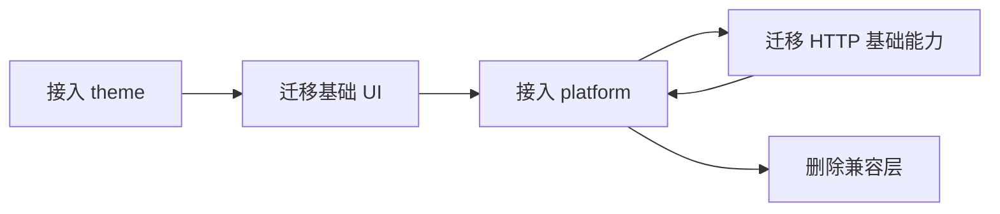

# 业务应用迁移指南

## 1. 原则

每个应用独立选择迁移时间。一次迁移一个能力域，并保持名称、Props、事件和行为尽可能不变。推荐以 `g2rain-member-app` 作为首个试点。

在正式 Registry 版本可用前，试点应用应使用 `npm pack` 产物安装，不以 `npm link` 作为验收依据。接入门槛见[接入就绪清单](../development/integration-readiness.md)。Main Shell 与业务 App 的接法见[Main Shell 接入](../development/main-integration.md)和[业务 App 接入](../development/app-integration.md)，不在本指南里重复。

## 2. 迁移顺序



主题先行，让后续公共组件直接使用统一变量；平台数据组件依赖 `G2rainPlatformUi` Provider；HTTP 和 Platform 涉及认证及全局状态，在 UI 稳定后迁移。

## 3. 单个能力的迁移步骤

1. 盘点本地实现、调用点和应用耦合。
2. 在公共包建立最小、无业务依赖的 API。
   首批 UI 必须按[组件基准与公开契约](../packages/component-migration-baseline.md)选择来源，不能默认整目录复制。
3. 使用 Playground 验证公共实现。
4. 通过 `npm pack` 在试点应用安装制品。
5. 必要时保留本地兼容转发，维持原导入路径。
6. 完成类型检查、生产构建及两种运行模式验证。
7. 回写 Member 验证结论；仅在 Appkit 整体验证通过并正式发布后，锁定 Registry 版本范围。
8. 删除已无调用的本地源码副本。

## 4. 试点最小接入示例

### 4.1 安装制品

```bash
# 在 g2rain-appkit 仓库
npm run build
npm pack --workspace @g2rain/theme
npm pack --workspace @g2rain/ui

# 在试点应用
npm install ../g2rain-appkit/g2rain-theme-0.1.0.tgz
npm install ../g2rain-appkit/g2rain-ui-0.1.0.tgz
```

正式发布后改为 `~0.1.0` 版本范围。

### 4.2 样式与插件

```ts
import '@g2rain/theme/styles.css'
import '@g2rain/ui/style.css'
import { G2rainUi } from '@g2rain/ui'
import { G2rainPlatformUi } from '@g2rain/ui/platform'

app.use(G2rainUi, {
  translate: (key, fallback) => t(key, fallback),
  locale: () => localeStore.locale,
})
app.use(G2rainPlatformUi, {
  dataProviders: {
    organ: {
      loadOptions: params => organApi.select(params),
      getPolicy: () => ({
        defaultValue: tokenStore.isAdminCompany ? null : tokenStore.organId,
        clearable: tokenStore.isAdminCompany,
        autoSelectFirstWhenEmpty: !tokenStore.isAdminCompany && tokenStore.organId == null,
      }),
    },
    dict: {
      loadOptions: params => dictService.select(params),
    },
  },
})
```

### 4.3 兼容转发

在应用原导出路径保留转发，避免一次性改完所有导入：

```ts
// src/components/QueryForm/index.ts
export { QueryForm, type QueryFormData, type QueryFormExpose } from '@g2rain/ui'

// src/components/TableSort/index.ts
export {
  SortableTable,
  TableColumn,
  SortDialog,
  SortManagerButton,
  useTableSort,
} from '@g2rain/ui'

// src/components/RemoteSelect/index.ts
export {
  RemoteSelect,
  ApiSelect,
} from '@g2rain/ui'
export {
  DictSelect,
  OrganSelect,
  DictText,
  StatusSwitch,
} from '@g2rain/ui/platform'
```

验证通过后再删除被转发的本地 `.vue` / `.ts` 实现文件。同一应用不得同时注册两套同名全局组件。

### 4.4 HTTP 装配保留在应用

```ts
import { createHttpClient } from '@g2rain/http'

const { client, dispose } = createHttpClient({
  baseURL: runtimeConfig.apiBaseUrl,
  authSessionProvider: () => accessTokenStore.session,
  ensureAccessToken: options => accessTokenStore.ensure(options),
  authErrorHandler: (reason, error) => authService.handleFailure(reason, error),
  getLocale: () => localeStore.locale,
})
```

Client 单例表、Mock、环境 URL、与 Loading 的联动仍由应用维护。qiankun 卸载时调用 `dispose()`。

### 4.5 Platform 按能力接入

```ts
import { createThemeController } from '@g2rain/platform/theme'
import { createBrowserEventAdapter } from '@g2rain/platform/micro-app'
import { createPermissionPlugin } from '@g2rain/platform/permission/vue'
import { createLoadingController } from '@g2rain/platform/loading'

const theme = createThemeController()
const events = createBrowserEventAdapter()
const loading = createLoadingController({
  open: () => {
    // 应用注入具体 Loading UI，例如 Element Plus loading 服务
    const handle = appLoadingService.open()
    return { close: () => handle.close() }
  },
})
app.use(createPermissionPlugin({ provider: permissionStore }))

// 卸载时：
theme.dispose()
events.dispose()
loading.dispose()
```

消息 Processor、Token 交换流程等应用专属编排继续留在 App；只替换事件 Adapter、主题 Controller、权限插件和 Loading 管理器内核。

## 5. 分域迁移要点

### 主题

- 显式引入 `@g2rain/theme/styles.css`（或按需引入 tokens / light / dark / element-plus）。
- 将硬编码颜色逐步替换为 `--g2-*` 变量。
- 独立模式初始化根主题；集成模式服从主应用并释放监听器。

### UI

- 优先迁移 `QueryForm`、`TableSort` 和 `RemoteSelect`。
- 再迁移 `OrganSelect`、`DictSelect`、`DictText`、`StatusSwitch`，并从 `@g2rain/ui/platform` 导入，按[平台数据组件](../packages/platform-data-components.md)注入 `G2rainPlatformUi`。
- StatusSwitch 已改为“成功后更新”，且不再自动 `ElMessage`；应用需自行处理 success/error 提示。
- 对照原组件验证 Props、事件、Slots、空状态和错误状态。

### HTTP 与 Platform

- 先区分纯 HTTP 能力与应用装配代码。
- 将环境、Token、刷新、语言和登录失败处理注入 Client 工厂。
- 权限、Loading、主题和微应用监听按能力逐项接入。
- 验证认证刷新并发、Loading 并发和重复挂载场景。

## 6. 完成标准

- 应用不再保留已迁移能力的源码副本。
- 类型检查与生产构建通过。
- 独立运行正常。
- qiankun 加载、卸载和重新加载正常。
- 亮色与暗色主题一致。
- 回滚只需恢复依赖和 lockfile。
- 试点结果回写 `docs/project.yaml` 的 `validation` 字段。
